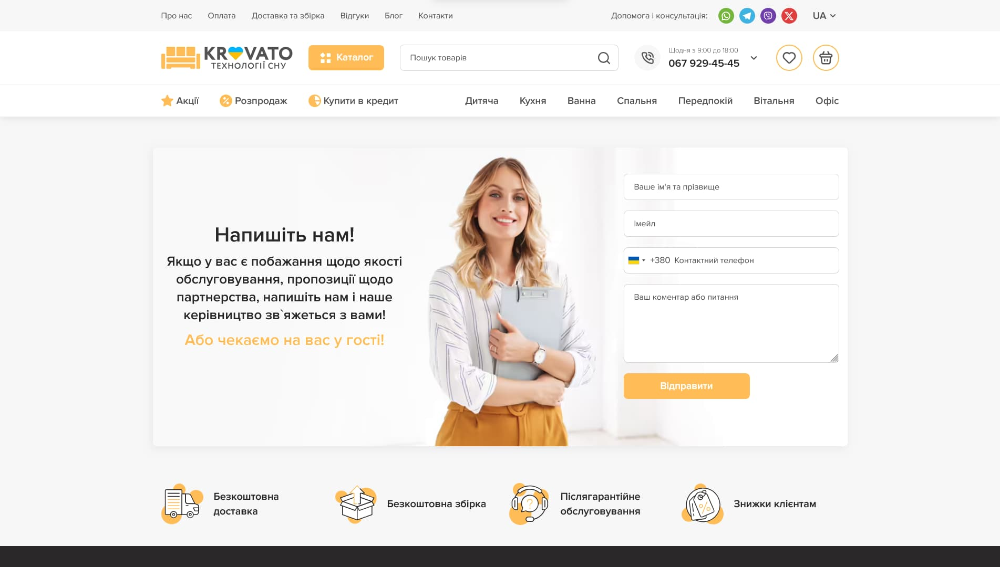

# FLS2024 spring course - Krovato source files

This is source files of FLS2024 spring course practice project - a multi-page e-commerce website.

## Table of contents

- [Overview](#overview)
  - [The challenge](#the-challenge)
  - [Screenshot](#screenshot)
  - [Links](#links)
    - [Pages](#pages)
- [My process](#my-process)
  - [Built with](#built-with)
  - [What I learned](#what-i-learned)
    - [PUG](#pug)
    - [SCSS](#scss)
  - [Useful resources](#useful-resources)
- [Author](#author)
- [Acknowledgments](#acknowledgments)

## Overview

### The challenge

Users should be able to:

- View the optimal layout for the interface depending on their device's screen size
- See hover and focus states for all interactive elements on the page

### Screenshot



### Links

- Solution URL: [https://github.com/Arkanit7/krovato](https://github.com/Arkanit7/krovato)
- Live Site URL: [https://krovato.netlify.app/](https://krovato.netlify.app/)

#### Pages

- [Home](https://krovato.netlify.app/index.html)
- [Catalog](https://krovato.netlify.app/set.html)
- [Product](https://krovato.netlify.app/product.html)
- [Checkout](https://krovato.netlify.app/checkout.html)
- [About](https://krovato.netlify.app/about.html)
- [Payment](https://krovato.netlify.app/payment.html)
- [Delivery](https://krovato.netlify.app/delivery.html)
- [Reviews](https://krovato.netlify.app/reviews.html)
- [Blog](https://krovato.netlify.app/blog.html)
- [Article](https://krovato.netlify.app/article.html)
- [Contacts](https://krovato.netlify.app/contacts.html)

## My process

### Built with

- HTML, PUG
- SCSS
- JS
- BEM
- CSS columns
- CSS container queries
- Reliability
- Convenience
- Optimization
- Semantics & Accessability
- SVG sprite
- Gulp

### What I learned

#### PUG

How to use templates with PUG

templates/\_layout.pug

```pug
block document
  doctype html
  html(lang="uk")
    head
      block head
        meta(charset="UTF-8")
        meta(name="viewport", content="width=device-width, initial-scale=1.0")
        meta(name="theme-color", content="#ffbc57")
        title #{ title || "Krovato – технології сну" }
        // Styles
        link(href="css/style.min.css", rel="stylesheet")
        script(src="js/app.min.js", defer)
    body
      // Content wrapper
      .wrapper
        // Header
        include ../includes/_header
        // Main
        main#main.wrapper__main.main(class=mainClass)
          block main

        // Advantages
        include ../includes/_advantages
        // Footer
        include ../includes/_footer
```

about.pug

```pug
extends templates/_layout

block prepend document
  - const title = "Про нас — Krovato";

block main
  +breadcrumbs([{name: "Головна", href: "/"}],"Про нас")

  //- Fade block
  include includes/about/_fade-block.pug

  //- Group block
  include includes/about/_group-block.pug

  //- Recent reviews
  include includes/_recent-reviews.pug

  //- Plain block
  include includes/_plain-block.pug

```

#### SCSS

First time using CSS Columns to implement specific layout:

```scss
// .reach__list

&__list {
  columns: 2;
  column-gap: rem(30px);
}

// .reach__item

&__item {
  break-inside: avoid-column;
}
```

Container queries are such game changer!

```scss
.card-review {
  container-type: inline-size;

  // .card-review__header

  &__header {
    display: grid;
    grid-template-areas: "avatar title time" "avatar stars stars";
    grid-template-columns: auto 1fr;
    gap: rem(2px 12px);

    @container (#{em($small)} <= width) {
      grid-template-areas: "avatar title stars time";
      align-items: center;
    }
  }
}
```

### Useful resources

- [International Telephone Input](https://intl-tel-input.com/) - beautiful inputs with country flags.
- [tippy.js](https://tippyjs.bootcss.com/) - an easy to use little tips popups.
- [noUiSlider](https://refreshless.com/nouislider/) - powerful range slider.
- [Swiper](https://swiperjs.com/) - handy slider.

## Author

- Website - [Portfolio](https://arkanit7.github.io/)
- GitHub - [Arkanit7](https://github.com/Arkanit7)

## Acknowledgments

Big thanks to [Yevhen Andrikanych](https://www.linkedin.com/company/freelancerlifestyle/) for sharing figma design & mentoring this project!
